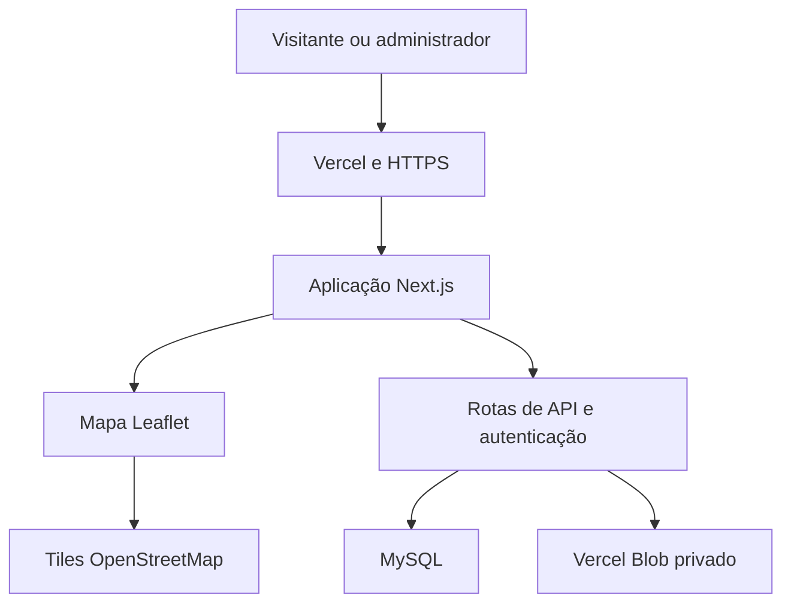
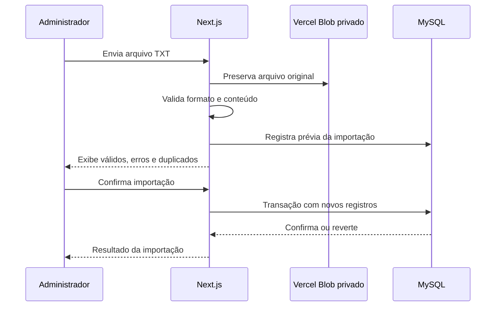
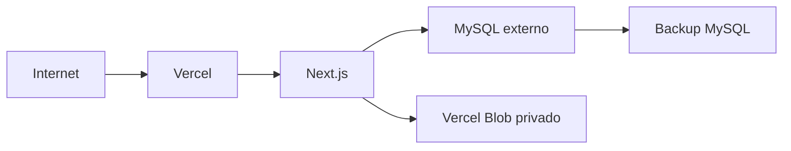

# Arquitetura Recomendada — Nascentes do Cariri

## 1. Objetivo

Este documento define a arquitetura técnica recomendada para o sistema do projeto **Nascentes do Cariri**, considerando os seguintes requisitos principais:

- mapa público interativo com Leaflet;
- incorporação no site `nascentesdocariri.ufca.edu.br`;
- aplicação hospedada em `nascentesdocariri.bessapontes.com.br`;
- autenticação de administradores;
- upload e validação de arquivos TXT;
- histórico das importações;
- preservação permanente dos arquivos originais;
- armazenamento das nascentes em MySQL;
- backend de pequena complexidade e baixo custo de manutenção.

## 2. Decisão arquitetural

Adotar uma aplicação **full-stack em Next.js com TypeScript**, reunindo frontend público, painel administrativo e API no mesmo projeto.

Essa escolha evita a criação de dois projetos independentes — um frontend em Vite e um backend separado — sem comprometer as necessidades de autenticação, upload, persistência e segurança.

### Stack principal

| Componente | Tecnologia recomendada |
| --- | --- |
| Aplicação full-stack | Next.js com App Router |
| Linguagem | TypeScript |
| Interface | React |
| Mapa | Leaflet 1.9.4 |
| Banco de dados | MySQL 8 ou superior |
| ORM | Prisma ORM |
| Validação | Zod |
| Autenticação | Auth.js com sessão em banco de dados |
| Estilização | CSS Modules ou Tailwind CSS |
| Hospedagem e HTTPS | Vercel |
| Arquivos TXT | Vercel Blob em store privado |
| Mapa-base | OpenStreetMap |

## 3. Visão geral



O Next.js será a única aplicação de negócio e será implantado na Vercel, responsável pela execução, distribuição, domínio e HTTPS. O Next.js acessará um serviço MySQL externo por meio do Prisma e armazenará todos os arquivos TXT no Vercel Blob, em store privado.

## 4. Responsabilidades dos componentes

### 4.1. Next.js

O Next.js será responsável por:

- renderizar a página pública do mapa;
- disponibilizar a página apropriada para o `iframe`;
- renderizar o painel administrativo;
- autenticar e autorizar administradores;
- receber e validar arquivos TXT;
- coordenar as transações de importação;
- fornecer a API pública das nascentes;
- fornecer endpoints administrativos;
- acessar o MySQL;
- registrar logs de aplicação e auditoria.

### 4.2. Leaflet

O Leaflet será executado somente no navegador e será responsável por:

- carregar o mapa-base do OpenStreetMap;
- renderizar os marcadores;
- ajustar o enquadramento às nascentes;
- exibir tooltip no mouseover;
- exibir popup no clique ou toque;
- aplicar filtros visuais;
- agrupar marcadores quando necessário;
- adaptar o mapa ao `iframe` e a dispositivos móveis.

O Leaflet não deverá acessar diretamente o arquivo TXT. Ele consumirá apenas dados validados fornecidos pela API pública.

### 4.3. MySQL

O MySQL armazenará:

- usuários administrativos;
- sessões, se a estratégia adotada utilizar sessões persistidas;
- metadados das importações;
- nascentes importadas;
- vínculo entre nascente e importação;
- estado e resultado de cada processamento;
- registros de auditoria relevantes.

### 4.4. Armazenamento com Vercel Blob

Todos os arquivos TXT originais deverão ser preservados no **Vercel Blob**, utilizando um store privado vinculado ao projeto da Vercel. O acesso de escrita será realizado somente por código autorizado no servidor ou por upload direto com autorização temporária emitida após autenticação do administrador.

O MySQL deverá armazenar o nome original, pathname ou referência do blob, hash SHA-256, tamanho, usuário e data da importação. O pathname deverá ser único, preferencialmente composto pelo identificador da importação e um UUID ou sufixo aleatório. Um upload nunca poderá sobrescrever o blob de uma importação anterior.

Os arquivos não deverão ser salvos:

- no repositório ou bundle da aplicação;
- em pasta pública do Next.js;
- no filesystem temporário de uma função da Vercel;
- com nome capaz de sobrescrever uma importação anterior.

O token de escrita do Vercel Blob deverá permanecer em variável de ambiente do servidor. URLs ou mecanismos de acesso aos blobs privados não deverão ser expostos pela API pública.

## 5. Organização sugerida do projeto

```text
nascentes-do-cariri/
├── prisma/
│   ├── schema.prisma
│   ├── migrations/
│   └── seed.ts
├── public/
│   └── assets/
├── src/
│   ├── app/
│   │   ├── (public)/
│   │   │   ├── page.tsx
│   │   │   └── mapa/
│   │   │       └── page.tsx
│   │   ├── admin/
│   │   │   ├── login/
│   │   │   ├── importacoes/
│   │   │   └── layout.tsx
│   │   ├── api/
│   │   │   ├── auth/
│   │   │   ├── public/
│   │   │   │   ├── nascentes/
│   │   │   │   └── municipios/
│   │   │   └── admin/
│   │   │       └── importacoes/
│   │   ├── layout.tsx
│   │   └── globals.css
│   ├── components/
│   │   ├── map/
│   │   ├── admin/
│   │   └── ui/
│   ├── lib/
│   │   ├── auth/
│   │   ├── db/
│   │   ├── importacao/
│   │   ├── blob/
│   │   ├── validation/
│   │   └── security/
│   ├── services/
│   ├── types/
│   └── middleware.ts
├── tests/
│   ├── unit/
│   ├── integration/
│   └── e2e/
├── AGENTS.md
├── REQUISITOS_MAPA_NASCENTES_DO_CARIRI.md
├── next.config.ts
├── package.json
└── tsconfig.json
```

O projeto não deverá depender de pasta local persistente para os TXT. Em desenvolvimento, deverá usar um store Vercel Blob separado do ambiente produtivo ou um adaptador específico para testes.

## 6. Divisão da aplicação

### 6.1. Área pública

Rotas sugeridas:

- `/`: apresentação resumida ou redirecionamento para o mapa;
- `/mapa`: mapa público preparado para acesso direto e incorporação;
- `/api/public/nascentes`: dados públicos das nascentes;
- `/api/public/municipios`: municípios usados no filtro.

A área pública não deverá carregar dependências administrativas nem dados privados.

### 6.2. Área administrativa

Rotas sugeridas:

- `/admin/login`;
- `/admin`;
- `/admin/importacoes`;
- `/admin/importacoes/nova`;
- `/admin/importacoes/[id]`.

Todas as páginas administrativas, exceto login, deverão exigir sessão válida.

### 6.3. API administrativa

Endpoints sugeridos:

- `POST /api/admin/importacoes/validar`;
- `POST /api/admin/importacoes/[id]/confirmar`;
- `DELETE /api/admin/importacoes/[id]`;
- `GET /api/admin/importacoes`;
- `GET /api/admin/importacoes/[id]`.

A autorização deverá ser verificada no servidor em cada operação. Proteger apenas a interface não é suficiente.

## 7. Modelo de dados sugerido

### 7.1. Usuário

Campos mínimos:

- `id`;
- `nome`;
- `email` único;
- `passwordHash`, quando houver credencial própria;
- `ativo`;
- `createdAt`;
- `updatedAt`;
- `lastLoginAt`.

### 7.2. Importação

Campos mínimos:

- `id`;
- `usuarioId`;
- `nomeArquivoOriginal`;
- `nomeArquivoArmazenado`;
- `caminhoOuChaveArquivo`;
- `hashSha256`;
- `tamanhoBytes`;
- `totalLinhas`;
- `totalValidas`;
- `totalInvalidas`;
- `totalDuplicadas`;
- `status`;
- `mensagemErro`;
- `createdAt`;
- `confirmedAt`;
- `completedAt`.

Status recomendados:

- `VALIDATING`;
- `WAITING_CONFIRMATION`;
- `PROCESSING`;
- `COMPLETED`;
- `FAILED`;
- `CANCELLED`.

### 7.3. Nascente

Campos mínimos:

- `id`;
- `latitude`;
- `longitude`;
- `municipio`;
- `fonte`;
- `localidade`;
- `dataCriacao`;
- `vazaoMedia` em `m³/s`;
- `importacaoId`;
- `ativo`;
- `createdAt`;
- `updatedAt`.

### 7.4. Precisão dos campos

- latitude e longitude: usar `DECIMAL` com precisão suficiente para coordenadas geográficas, evitando `FLOAT`;
- vazão média: usar `DECIMAL` com escala definida a partir da precisão dos dados científicos;
- data de criação: usar `DATE`, pois representa a data em que a nascente surgiu na natureza;
- textos: usar `utf8mb4`.

### 7.5. Duplicidade

No MVP, considerar duplicado o registro que tiver a mesma combinação normalizada de:

- latitude;
- longitude;
- fonte.

Essa regra deverá ser reforçada no banco por índice único ou chave normalizada sempre que tecnicamente viável. A validação da aplicação não substitui a garantia do banco.

## 8. Fluxo de importação



### Regras do fluxo

1. Validar autenticação e autorização.
2. Validar extensão, tamanho e tipo esperado.
3. Gerar nome interno único para o arquivo.
4. Calcular SHA-256.
5. Salvar o arquivo original no Vercel Blob privado com pathname único.
6. Criar o registro da importação.
7. Ler o TXT em UTF-8 e separado por ponto e vírgula.
8. Validar cabeçalho e cada linha com Zod ou validadores equivalentes.
9. Exibir prévia antes da confirmação.
10. Ao confirmar, iniciar transação no MySQL.
11. Inserir apenas registros novos.
12. Não apagar registros de importações anteriores.
13. Confirmar a transação somente se toda a operação for bem-sucedida.
14. Atualizar o status e os totais da importação.

O arquivo original deverá permanecer preservado mesmo se a validação falhar. O histórico deverá registrar a falha para fins de auditoria.

## 9. Arquitetura do mapa

O componente do mapa deverá ser carregado somente no cliente, pois o Leaflet depende do DOM.

Responsabilidades separadas:

- cliente da API pública;
- validação e normalização da resposta;
- estado dos filtros;
- inicialização e cleanup do Leaflet;
- criação segura de marcadores;
- conteúdo de tooltip e popup;
- ajuste de bounds;
- estados de carregamento, vazio e erro.

Fluxo:

```text
API pública -> validação -> filtros -> camada de marcadores -> mapa Leaflet
```

Regras essenciais:

- Leaflet recebe coordenadas como `[latitude, longitude]`;
- GeoJSON, se adotado futuramente, usa `[longitude, latitude]`;
- popups e tooltips devem construir elementos com `textContent`;
- o mapa deve chamar `invalidateSize()` após alterações reais do container;
- a instância deve ser destruída com `map.remove()` no cleanup;
- o mapa deve usar clustering quando o volume medido justificar;
- a atribuição do OpenStreetMap deve permanecer visível.

## 10. Autenticação e autorização

Recomenda-se Auth.js com sessão persistida no banco ou sessão segura equivalente.

Regras:

- não permitir cadastro público;
- criar o primeiro administrador por seed ou comando seguro;
- armazenar senhas somente com hash moderno, caso credenciais próprias sejam usadas;
- utilizar cookies `HttpOnly`, `Secure` e `SameSite` apropriado;
- aplicar limitação de tentativas de login;
- invalidar sessões de usuário desativado;
- verificar a sessão em páginas e endpoints administrativos;
- não confiar em estado ou papel enviado pelo navegador.

Se a aplicação possuir apenas poucos administradores, não é necessário implementar um sistema complexo de papéis no MVP. Um atributo `ativo` e um papel `ADMIN` são suficientes.

## 11. Segurança

### 11.1. Upload

- limitar tamanho, inicialmente a 5 MB;
- aceitar somente um arquivo por operação;
- validar extensão e conteúdo;
- nunca executar ou servir o arquivo enviado;
- normalizar o nome apenas para metadados e gerar nome interno próprio;
- impedir path traversal;
- evitar que dois arquivos sejam sobrescritos;
- armazenar no Vercel Blob privado, nunca em `public` ou no filesystem temporário;
- registrar hash e tamanho;
- aplicar limite de requisições.

### 11.2. Banco de dados

- usar Prisma ou consultas parametrizadas;
- usar usuário MySQL exclusivo para a aplicação;
- conceder apenas permissões necessárias;
- não expor o MySQL à internet;
- usar transações na confirmação da importação;
- executar migrações de forma controlada.

### 11.3. Conteúdo do mapa

Dados do TXT são não confiáveis. Não interpolar município, fonte ou localidade diretamente em HTML. Usar `textContent` ou sanitização reconhecida.

### 11.4. Iframe

A rota pública `/mapa` poderá ser incorporada apenas por:

- `https://nascentesdocariri.bessapontes.com.br`;
- `https://nascentesdocariri.ufca.edu.br`.

Aplicar uma política equivalente a:

```text
Content-Security-Policy: frame-ancestors 'self' https://nascentesdocariri.ufca.edu.br
```

As rotas `/admin` deverão usar política separada que impeça incorporação externa.

## 12. OpenStreetMap e tiles

O mapa-base será OpenStreetMap. O endpoint de tiles deverá ser configurado por variável de ambiente.

Variáveis conceituais:

```text
NEXT_PUBLIC_TILE_URL=
NEXT_PUBLIC_TILE_ATTRIBUTION=
NEXT_PUBLIC_TILE_MAX_ZOOM=
```

A operação deverá:

- manter atribuição visível;
- respeitar a política do serviço de tiles;
- não presumir capacidade ilimitada de um servidor público;
- avaliar provedor compatível com OpenStreetMap caso o tráfego aumente;
- evitar tokens secretos no frontend.

## 13. Variáveis de ambiente

Exemplo de categorias necessárias:

```text
DATABASE_URL=
AUTH_SECRET=
APP_URL=https://nascentesdocariri.bessapontes.com.br
BLOB_READ_WRITE_TOKEN=
MAX_UPLOAD_SIZE_BYTES=5242880
NEXT_PUBLIC_TILE_URL=
NEXT_PUBLIC_TILE_ATTRIBUTION=
NEXT_PUBLIC_TILE_MAX_ZOOM=19
```

`BLOB_READ_WRITE_TOKEN` deverá ser criado e gerenciado pela integração do Vercel Blob com o projeto. Somente variáveis prefixadas com `NEXT_PUBLIC_` podem ser expostas ao navegador. `DATABASE_URL`, `AUTH_SECRET` e `BLOB_READ_WRITE_TOKEN` nunca deverão receber esse prefixo.

## 14. Implantação recomendada na Vercel

### 14.1. Componentes

- projeto Next.js na Vercel;
- domínio `nascentesdocariri.bessapontes.com.br` configurado na Vercel;
- store privado do Vercel Blob;
- serviço MySQL externo acessível pelas funções da Vercel;
- política de backup do MySQL;
- política de retenção e recuperação dos blobs.



### 14.2. Requisitos operacionais

- domínio e TLS gerenciados pela Vercel;
- ambientes separados de Preview e Production;
- variáveis de ambiente separadas por ambiente;
- observabilidade e logs da Vercel;
- backup diário do MySQL;
- política de retenção dos blobs que impeça exclusão automática indevida;
- procedimento de recuperação dos arquivos TXT;
- teste periódico de restauração;
- monitoramento de disponibilidade, funções, banco e consumo do Blob;
- implantação com rollback.

O backup do banco e a política de retenção do Vercel Blob deverão ser coerentes, pois o MySQL contém os metadados que apontam para os blobs preservados. Nenhuma rotina de limpeza deverá excluir um blob associado a uma importação registrada.

### 14.3. Upload no ambiente Vercel

Como funções hospedadas possuem limites de corpo e duração que podem variar por plano e runtime, a implementação deverá confirmar os limites vigentes antes da entrega. Para arquivos que possam ultrapassar o limite de upload via função, usar upload direto ao Vercel Blob pelo cliente:

1. o administrador autenticado solicita autorização de upload;
2. o servidor confirma sessão, permissão, extensão e pathname permitido;
3. o servidor emite autorização temporária e limitada;
4. o navegador envia o TXT diretamente ao Vercel Blob;
5. o backend registra o blob e executa a validação e a importação;
6. o blob permanece privado e associado ao histórico.

O token principal de escrita nunca deverá ser enviado ao navegador.

## 15. Estratégia de desenvolvimento

### Fase 1 — Fundação

- criar projeto Next.js com TypeScript;
- configurar lint, formatação e testes;
- configurar Prisma e MySQL;
- criar schema e migrações;
- configurar autenticação;
- criar administrador inicial.

### Fase 2 — Importação

- integrar um store privado do Vercel Blob;
- implementar parser TXT;
- implementar validações;
- implementar prévia;
- implementar transação e histórico;
- testar falhas, duplicidades e rollback.

### Fase 3 — Mapa público

- integrar Leaflet;
- integrar OpenStreetMap;
- criar marcadores, tooltip e popup;
- implementar enquadramento do Cariri Cearense;
- implementar filtros;
- testar responsividade e iframe.

### Fase 4 — Produção na Vercel

- criar o projeto e os ambientes na Vercel;
- vincular o store privado do Vercel Blob;
- configurar domínio e HTTPS;
- configurar conexão segura com o MySQL externo;
- configurar CSP e `frame-ancestors`;
- configurar backups, retenção, observabilidade e logs;
- executar testes de segurança e aceitação;
- implantar e validar no domínio institucional.

## 16. Estratégia de testes

### Unitários

- parser do TXT;
- cabeçalho e campos obrigatórios;
- coordenadas;
- datas;
- vazão em `m³/s`;
- duplicidades;
- nomes internos dos arquivos;
- filtros e formatação do mapa.

### Integração

- autenticação;
- upload e preservação do TXT;
- persistência no MySQL;
- transação e rollback;
- histórico da importação;
- API pública sem campos privados.

### End-to-end

- login administrativo;
- validação e confirmação de importação;
- erro sem alteração da base;
- arquivo anterior preservado;
- marcadores no mapa;
- tooltip, popup e filtros;
- funcionamento em celular;
- funcionamento dentro do `iframe`.

## 17. O que não utilizar no MVP

Não é necessário adotar inicialmente:

- backend separado em NestJS, Laravel ou FastAPI;
- microserviços;
- Kubernetes;
- fila de mensagens para arquivos pequenos;
- Redis, salvo necessidade comprovada;
- PostGIS;
- GraphQL;
- armazenamento adicional além do Vercel Blob;
- sistema amplo de papéis e permissões.

Esses componentes só deverão ser introduzidos quando houver necessidade medida e documentada.

## 18. Limites da arquitetura

Esta arquitetura é adequada para baixo ou médio volume de acessos, poucos administradores e arquivos TXT pequenos.

Reavaliar a solução quando houver:

- arquivos muito grandes;
- importações concorrentes frequentes;
- dezenas de milhares de marcadores carregados simultaneamente;
- múltiplas instâncias da aplicação;
- alta disponibilidade obrigatória;
- processamento geoespacial avançado;
- necessidade de integração com muitos sistemas externos.

Nesses cenários, poderão ser introduzidos processamento assíncrono, filas, cache, carregamento geográfico por viewport ou serviços especializados, mantendo ou reavaliando o Vercel Blob conforme custos e limites medidos.

## 19. Decisões consolidadas

1. A aplicação será full-stack em Next.js com TypeScript.
2. Não haverá backend separado no MVP.
3. O mapa utilizará Leaflet 1.9.4.
4. O mapa-base será OpenStreetMap.
5. O banco será MySQL 8 ou superior.
6. O acesso ao banco será feito preferencialmente com Prisma.
7. A validação será feita com Zod.
8. A autenticação será baseada em sessão segura, preferencialmente com Auth.js.
9. Arquivos TXT serão preservados em um store privado do Vercel Blob.
10. Importações serão cumulativas e não apagarão dados anteriores.
11. O sistema será implantado na Vercel, com domínio e HTTPS gerenciados pela plataforma.
12. O mapa poderá ser incorporado somente nos domínios autorizados.

## 20. Critério de aceite arquitetural

A arquitetura estará corretamente implantada quando:

- frontend, backend e API funcionarem em uma aplicação Next.js;
- o MySQL não estiver exposto publicamente;
- os TXT permanecerem no Vercel Blob após novas implantações;
- nenhuma importação sobrescrever arquivos anteriores;
- importações falhas não alterarem as nascentes existentes;
- a API pública expuser somente dados permitidos;
- o mapa funcionar diretamente e no `iframe` institucional;
- o painel administrativo estiver protegido;
- o backup do MySQL e a política de retenção e recuperação dos blobs estiverem configurados e testados;
- lint, tipos, testes e build de produção forem executados com sucesso.
